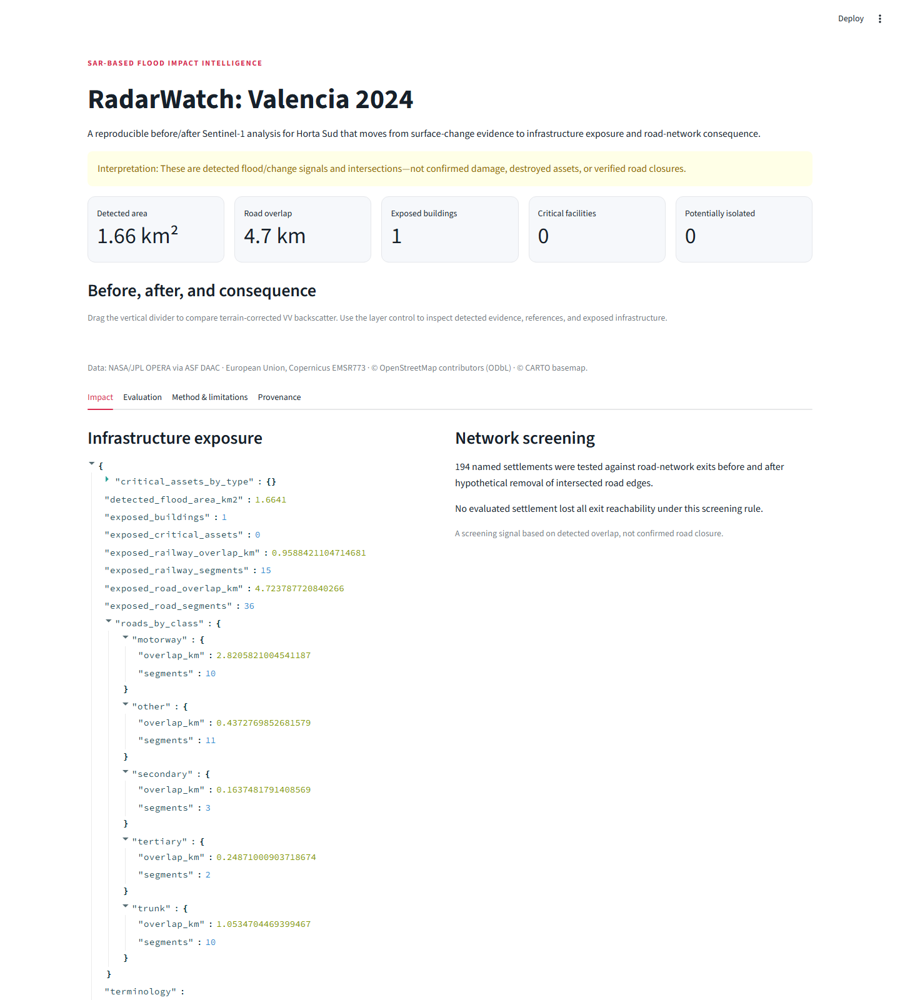
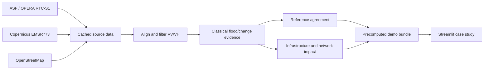

# RadarWatch

**SAR-based Earth-change and disaster-impact intelligence.**

RadarWatch is an independent 2026 portfolio project inspired by NASA Space
Apps 2025's “Through the Radar Looking Glass” challenge. It is **not** a NASA
Space Apps submission and is not affiliated with or endorsed by NASA, ESA,
Copernicus, or ISRO.

The Valencia MVP uses matched before/after Sentinel-1 observations to detect
flood/change evidence in Horta Sud, intersect that evidence with infrastructure,
screen for potential road-network isolation, and explain the result in a public
interactive case study.

> Earlier work explored geospatial foundation models for disaster detection in
> GeoAI ReImagined. RadarWatch revisits the problem as a new project using the
> more mature 2026 Earth-observation ecosystem, with an emphasis on reproducible
> SAR processing and operational consequence.

## App preview



## MVP case study

- Event: Valencia flood, 29 October 2024
- Study area: Copernicus EMSR773 AOI03, Horta Sud
- SAR: NASA OPERA RTC-S1, VV/VH, 30 m
- Before: 19 October 2024
- After: 31 October 2024
- Method: low post-event VV plus VV/VH backscatter decrease
- Consequence layers: roads, railways, buildings, critical facilities, and a
  conservative potential-isolation signal

RadarWatch reports **detection and exposure**, not confirmed damage. A road or
building intersecting detected flood evidence is not necessarily damaged or
closed.

## Valencia results

The reproducible real-data run completed successfully on 18 August 2026. The
default detector produced 1.6641 km² of flood/change evidence. Against the
exact-time CEMS Sentinel-1 delineation it achieved 0.450 IoU and 0.620 Dice/F1;
against the optical extent from roughly eight hours earlier it achieved 0.059
IoU and 0.112 Dice/F1. The lower cross-sensor result remains visible as an
important temporal and methodological limitation.

| Result | Value |
| --- | ---: |
| Exact-time precision / recall | 0.653 / 0.591 |
| Intersected road segments / overlap | 36 / 4.72 km |
| Intersected railway segments / overlap | 15 / 0.96 km |
| Exposed buildings / critical facilities | 1 / 0 |
| Potentially isolated / settlements evaluated | 0 / 194 |
| Full pipeline runtime | 82.6 seconds |
| Public demo bundle | 2.93 MB |

The three-class Multi-Otsu threshold reached the configured upper clamp of
`-12 dB`. This is reported in the app and provenance rather than silently
retuned against either reference.

## Architecture



Heavy geospatial work is offline. The hosted application reads only derived
PNG, GeoJSON, and JSON files; it does not download imagery or run inference on
web requests.

## Local setup

Requirements:

- Python 3.12
- [`uv`](https://docs.astral.sh/uv/)
- A free NASA Earthdata account with the ASF terms accepted

```powershell
uv sync --all-extras
uv run radarwatch validate --config configs/valencia.yaml
```

ASF downloads use NASA's `earthaccess` authenticated HTTPS session and the
conventional Earthdata netrc entry:

```text
machine urs.earthdata.nasa.gov
    login YOUR_USERNAME
    password YOUR_PASSWORD
```

Use `%USERPROFILE%\_netrc` on Windows or `~/.netrc` on Unix-like systems. Never
commit that file. Sign in to [NASA Earthdata Login](https://urs.earthdata.nasa.gov/)
and accept the ASF data terms through [ASF Vertex](https://search.asf.alaska.edu/)
before the first run.

Run the complete pipeline:

```powershell
uv run radarwatch run --config configs/valencia.yaml
```

Resume from cached source data:

```powershell
uv run radarwatch run --config configs/valencia.yaml --from-stage prepare --offline
```

Run the public app after `publish` completes:

```powershell
uv run streamlit run app.py
```

## Pipeline stages

1. `acquire` validates exact ASF catalogue records, downloads OPERA VV/VH and
   masks, fetches two CEMS references, and caches OSM infrastructure.
2. `prepare` mosaics matched bursts onto one EPSG:32630 grid, converts power to
   dB, applies the validity mask and a 3×3 median filter, and creates browse
   images.
3. `detect` derives a clamped three-class Multi-Otsu water threshold, combines
   it with dual-pol decrease rules, removes small components, and vectorizes the
   result.
4. `evaluate` reports IoU, Dice/F1, precision, recall, FPR, area, and threshold
   sensitivity against two explicitly caveated CEMS products.
5. `impact` calculates infrastructure exposure and tests named-settlement
   reachability after hypothetical removal of intersected road edges.
6. `publish` creates a runtime-only demo bundle under 30 MB with metrics and
   complete provenance.

Every stage writes an atomic, hash-validated record to `data/stages`. Cached
work is reused only while the configuration, dependency record, and output
hashes match.

## Evaluation semantics

The exact-time comparison uses a CEMS product derived from the same Sentinel-1
acquisition, so it is reported as **operational-product agreement**, not
independent validation. The Horta Sud optical comparison is independent but
was acquired roughly eight hours earlier during a fast-changing flash flood.
Neither is described as field-validated ground truth.

The default thresholds are not tuned against either reference. Strict and
lenient variants show threshold sensitivity.

## Data sources and attribution

- OPERA RTC-S1: NASA/JPL, distributed by NASA ASF DAAC
- Flood delineations: European Union, Copernicus Emergency Management Service,
  EMSR773
- Infrastructure: © OpenStreetMap contributors, ODbL
- Hosted map context: © OpenStreetMap contributors, © CARTO

Upstream datasets retain their own terms. The MIT license in this repository
applies to RadarWatch source code, not to upstream data.

## Limitations

- Urban double-bounce can obscure inundation in SAR.
- Wet soil, agriculture, and surface roughness changes can resemble flooding.
- The event evolved between the flood peak, optical reference, and SAR pass.
- OSM is incomplete and is not an authoritative asset inventory.
- Exposure is geometric intersection, not confirmed damage.
- Potential isolation assumes intersected road edges are unavailable; no
  observed closure data is used.
- V1 does not use NISAR, an EO foundation model, optical fusion, population
  exposure, live processing, or an emergency-response agent.

## Development

```powershell
uv run ruff check .
uv run ruff format --check .
uv run pytest
```

CI runs the network-free test suite on Windows and Ubuntu. Real external-data
acquisition remains a documented local integration run because it requires an
Earthdata account.
